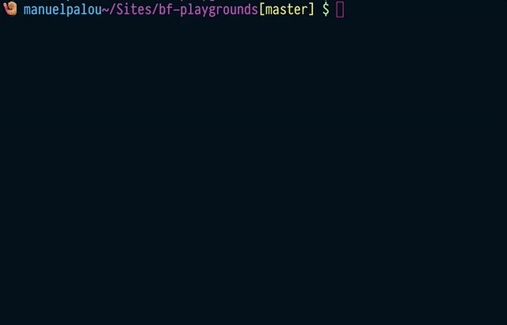

<p align="center">
  
</p>

# playgrounds

A service & framework for building demo sites.

# Usage

```bash
$ npm i
```

```bash
$ npm run create <name> <optional template>
```

## Templates

simple webpack (default):

```bash
$ npm run create my-app
```

react + webpack:

```bash
$ npm run create my-app webpack-react
```

threejs + webpack:

```bash
$ npm run create my-app webpack-threejs
```

Check out your new playground:

```bash
$ cd playgrounds/<name>
```

```bash
$ npm i
```

Start dev server:

```bash
$ npm run dev
```

Create new build:

```bash
$ npm run build
```

# API

To include an API route, create an `/api/` folder with an `index.js` that exports an express `router`.


eg:

```
import {Router} from 'express';
import request from 'request'; // could be any request libary or even node's http

router.get('/example', (req, res) => {
    const reqOptions = {
        headers: {
            'User-Agent': 'example-app',
        },
    };

    request.get(REPO_ROUTE, reqOptions, (err, resp) => {
        // handle however you want
        if (err) {
            res.status(500).send(err);
        } else if (resp.statusCode === 200) {
            res.json(JSON.parse(resp.body));
        } else {
            res.send(resp);
        }
    });
});
```

To make front end requests in your app, use your library of choice to send requests. We recommend using [superagent](https://www.npmjs.com/package/superagent).
When making requests, the environment variable `BASE_API_URL` will be available to you.

eg:

```
import request from 'superagent';
request
  .get(`${process.env.BASE_API_URL}/example`)
  .set('Accept', 'application/json')
  .end((err, resp) => {
    document.getElementById('container').innerHTML = JSON.stringify(err || resp.body, 0, 2);
  });
```

see `api-demo` in `/playgrounds` for a working demo of this.

_NOTE: you will need to run the playgrounds server locally in tandem with your webpack server to use the api in development_

# Features

- `npm run dev`: first-in-class development experience.
  - State preserving hot-reload
  - State preserving compilation error overlay
  - Lint-on-save with ESLint
  - Source maps

- `npm run build`: Production ready build.
  - JavaScript minified with [UglifyJS](https://github.com/mishoo/UglifyJS2).
  - HTML minified with [html-minifier](https://github.com/kangax/html-minifier).
  - CSS across all components extracted into a single file and minified with [cssnano](https://github.com/ben-eb/cssnano).
  - All static assets compiled with version hashes for efficient long-term caching, and a production `index.html` is auto-generated with proper URLs to these generated assets.
